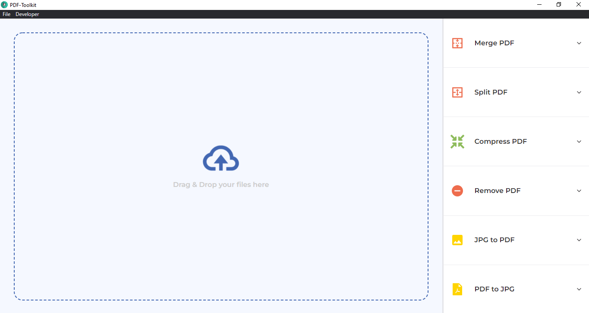
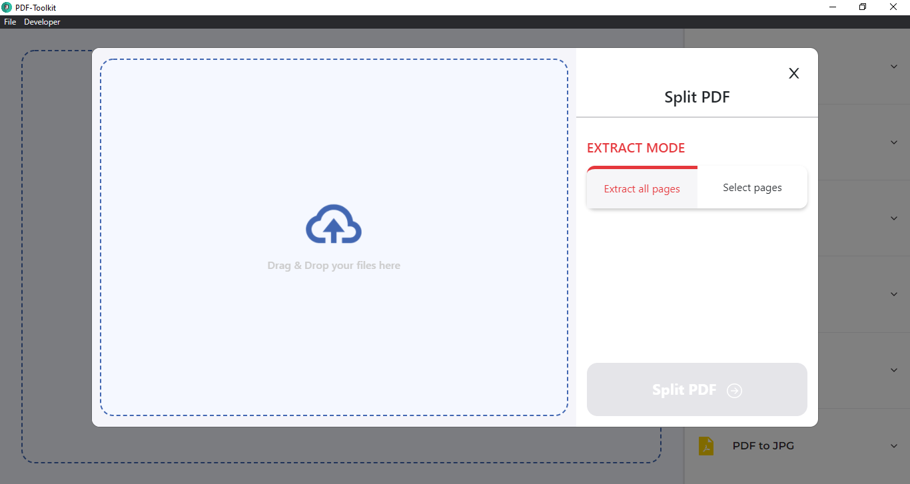
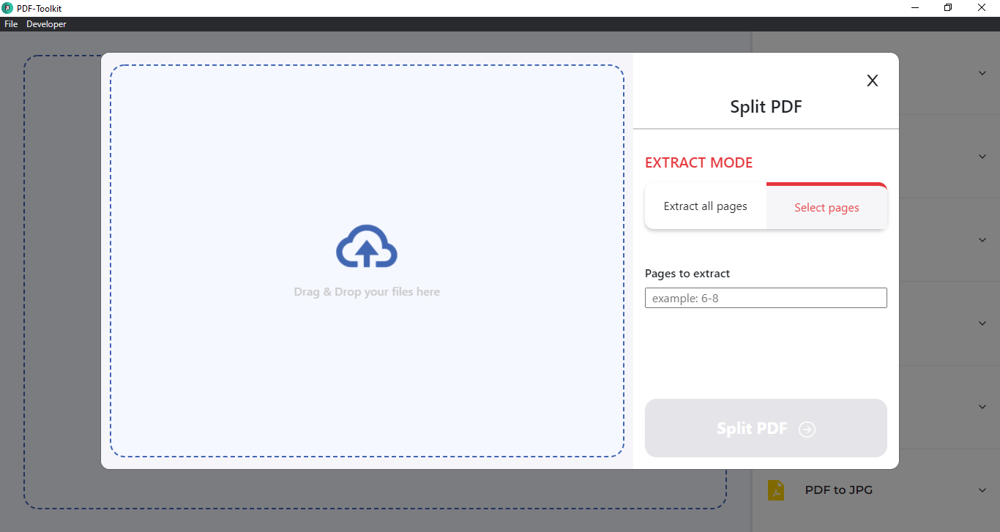
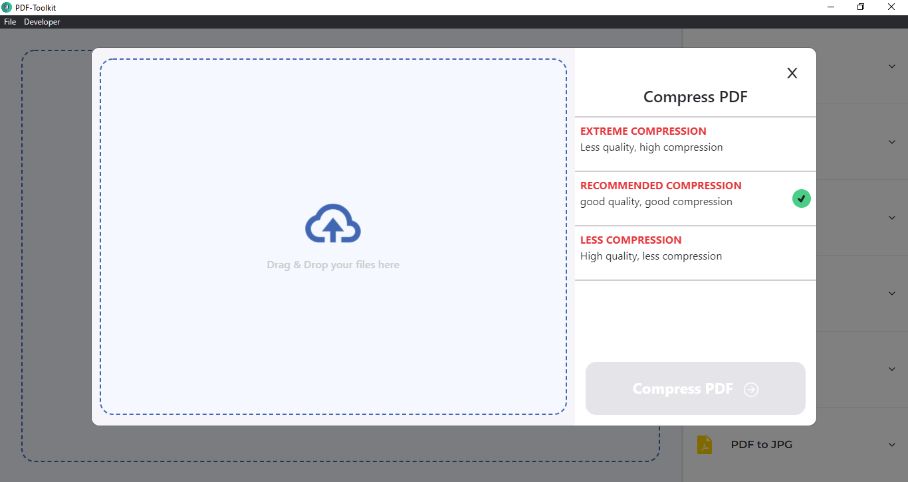
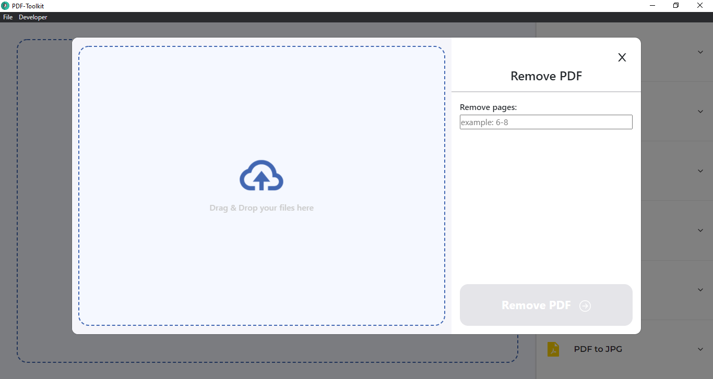
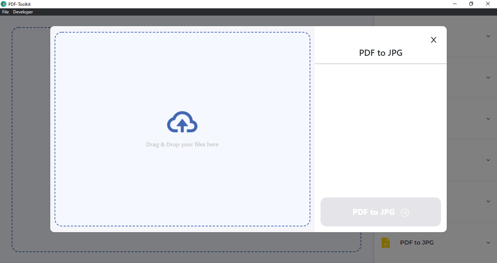

# PDF-Toolkit
PDF-Toolkit App developed using Electron.js, Ghostscript SDK.

## Features

- Cross platform application which can run on Windows, MacOS and Linux. (Tested only on Windows)
- Users can read PDF using the built in PDF reader.
- PDF transformation tools includes merging, compressing, splitting, removing pages, PDF to JPG, JPG to PDF.
- Completely free and offline.

## Tech

This application uses a number of open source projects to work properly:

- [Electron.js] -  Electron is a free and open-source software framework developed and maintained by GitHub. The framework is designed to create desktop applications using web technologies which are rendered using a flavor of the Chromium browser engine, and a backend using the Node.js runtime environment.
- [React] - React is a free and open-source front-end JavaScript library for building user interfaces based on UI components.
- [Webpack] - Webpack is a free and open-source module bundler for JavaScript. It is made primarily for JavaScript, but it can transform front-end assets such as HTML, CSS, and images if the corresponding loaders are included. Webpack takes modules with dependencies and generates static assets representing those modules.
- [Ghostscript] - Ghostscript is a suite of software based on an interpreter for Adobe Systems' PostScript and Portable Document Format page description languages.

And of course this application itself is open source with every code available here in github.

## Installation

##### For Users
Requires [Node.js](https://nodejs.org/) v10+ to run.
Requires GhostScript (Check the instruction in the PDF-Toolkit website - https://pdf-toolkit.netlify.app/instructions or the official GhostScript website)

##### For Developers

Install the dependencies and start the server.

```sh
cd ./
npm install
npm run watch
npm start
```

## Screenshot

### Main


### Merge
Two PDF can be merged by this option.


### Split
PDF can be splitted using this option. There is two ways to split the PDF, first by inputting the page number and the other option is to split every page.
- 
- 

### Compress
PDF can be compressed using this option. Three stages of compression is available..


### Remove
The pages in the PDF can be removed using this option.


### JPG to PDF
JPG image can be converted to PDF using this option. 


### PDF to JPG
PDF document can be converted to JPG using this option.


## Development

Want to contribute? Great!

This app uses Electron, React, Ghostscript and Webpack
Make a change in your file and instantaneously see your updates!

Open your favorite Terminal and run these commands.

Terminal:

```sh
cd ./
npm run watch
npm start
```

## Hosted
The link to download the App - [Click Here](https://pdf-toolkit.netlify.app/)

<!-- ## License

MIT -->


